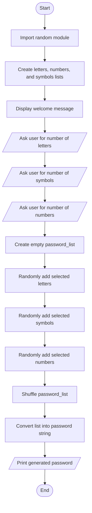

# 🔐 PyPassword Generator

A simple Python command-line password generator that creates randomized passwords using letters, numbers, and symbols based on the user's selected password composition.

## 📌 Overview

PyPassword Generator is a beginner-friendly Python project that helps users create secure random passwords from the terminal. The user chooses how many letters, symbols, and numbers should be included, and the program generates a shuffled password so the characters are not grouped together.

This project was written in **PyCharm**, a Python IDE that provides a helpful editor, built-in terminal, and easy run controls for Python files.

This project is great for practicing:

- Python lists
- `for` loops
- User input with `input()`
- Type conversion with `int()`
- Random selection using `random.choice()`
- List shuffling using `random.shuffle()`
- String building and output formatting

## ✨ Features

- 🔠 Generates a random password from letters, numbers, and symbols
- 🎛️ Lets the user choose the number of letters, symbols, and numbers
- 🔡 Uses both lowercase and uppercase English letters
- 🔀 Shuffles the password characters for better randomness
- 💻 Runs directly in the terminal
- 🧩 Uses only Python's built-in `random` module

## 🛠️ Technologies Used

- 🐍 Python 3
- 🎲 Built-in `random` module
- 💡 PyCharm IDE

## 💻 Development Environment

This project was created and tested using **PyCharm**. You can run the project from PyCharm by opening the project folder, selecting `password_generator.py`, and clicking the run button.

You can also run it from PyCharm's built-in terminal using:

```bash
python password_generator.py
```

## ⚙️ How It Works

The program follows these steps:

1. Imports the `random` module.
2. Stores available letters, numbers, and symbols in separate lists.
3. Asks the user how many letters, symbols, and numbers they want.
4. Randomly selects the requested number of characters from each list.
5. Adds all selected characters into a password list.
6. Shuffles the password list so the order is random.
7. Converts the shuffled list into a string.
8. Prints the final password.

## 🧭 Flowchart



## 🗺️ Program Map

```text
PyPassword Generator
|
|-- Character Data
|   |-- letters: lowercase and uppercase alphabet
|   |-- numbers: digits from 0 to 9
|   |-- symbols: special characters
|
|-- User Input
|   |-- number_of_letters
|   |-- number_of_symbols
|   |-- number_of_numbers
|
|-- Password Creation
|   |-- choose random letters
|   |-- choose random symbols
|   |-- choose random numbers
|   |-- store selected characters in password_list
|
|-- Randomization
|   |-- shuffle password_list
|
|-- Final Output
|   |-- join characters into password string
|   |-- display generated password
```

## ▶️ Example

```text
Welcome to the PyPassword Generator!
How many letters would you like in your password?
5
How many symbols would you like?
2
How many numbers would you like?
3
Here is your password: a7G#2dQ9+
```

The exact password will be different each time because the program randomly selects and shuffles the characters.

## 🚀 Getting Started

### ✅ Prerequisites

Make sure Python is installed on your computer.

Check your Python version:

```bash
python --version
```

or:

```bash
python3 --version
```

## 📦 Installation

1. Clone this repository:

```bash
git clone https://github.com/your-username/PyPassword-Generator.git
```

2. Open the project folder:

```bash
cd PyPassword-Generator
```

3. Run the Python file from the terminal:

```bash
python password_generator.py
```

or:

```bash
python3 password_generator.py
```

### 💡 Running in PyCharm

1. Open **PyCharm**.
2. Click **Open** and select the project folder.
3. Open `password_generator.py`.
4. Click the green **Run** button.
5. Enter the number of letters, symbols, and numbers when prompted.


## 🌐 Run Online on Replit

You can also run this project online using Replit without installing Python on your computer.

🔗 **Replit Link:** (https://replit.com/@numair1919/PyPassword-Generator)

### ▶️ How to Run on Replit

1. Open the Replit project link.
2. Click the **Run** button at the top.
3. The program will start in the Replit console.
4. Enter how many letters, symbols, and numbers you want in your password.
5. The generator will create and display a random shuffled password.


Example:

```text
Welcome to the PyPassword Generator!
How many letters would you like in your password?
5
How many symbols would you like?
2
How many numbers would you like?
3
Here is your password: G7#aQ2d9+

## 🧠 Key Python Concepts

### 🎯 `random.choice()`

The `random.choice()` function selects one random item from a list.

Example:

```python
random.choice(letters)
```

This selects one random letter from the `letters` list.

### 🔀 `random.shuffle()`

The `random.shuffle()` function changes the order of items in a list.

Example:

```python
random.shuffle(password_list)
```

This makes the password order random instead of keeping all letters first, then symbols, then numbers.

### 🔁 `for` Loops

The program uses `for` loops to repeat character selection based on the number entered by the user.

Example:

```python
for letter in range(1, number_of_letters + 1):
    password_list.append(random.choice(letters))
```

If the user enters `5`, the loop adds 5 random letters to the password list.

## 🧪 Easy Version vs Hard Version

### 🟢 Easy Version

The easy version creates a password string directly by adding letters, symbols, and numbers one after another.

Example result:

```text
abcDE!#123
```

This works, but the password pattern is predictable because letters, symbols, and numbers appear in groups.

### 🔵 Hard Version

The hard version stores all selected characters in a list and then shuffles that list.

Example result:

```text
D1#aE3b2c!
```

This is better because the characters are mixed randomly.

## 🌱 Possible Improvements

- ✅ Add input validation to prevent negative numbers or invalid text input
- 🔁 Add an option to generate multiple passwords at once
- 📊 Add password strength feedback
- 📏 Add a minimum password length check
- 💾 Save generated passwords to a file only when the user chooses to do so
- 🔐 Use Python's `secrets` module for stronger security in real-world password generation

## 🔒 Security Note

This project is useful for learning Python and basic password generation logic. For real-world security-sensitive applications, Python's `secrets` module is recommended because it is designed for generating cryptographically stronger random values.

## 📁 Project Structure

```text
PyPassword-Generator/
|
|-- password_generator.py
|-- README.md
```

## 👨‍💻 Author

Created by **Numair Fahad**.

## 📜 License

This project is open source and available under the MIT License.